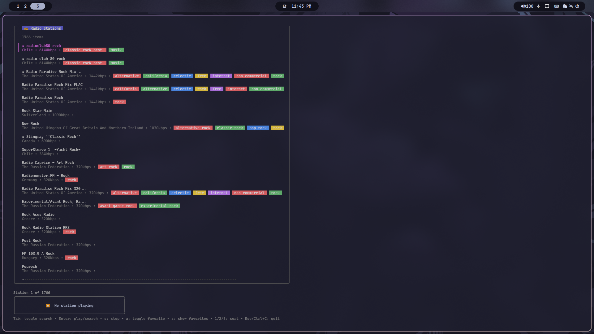

# 🎧 Terminal Radio Player

#### A sleek and interactive terminal interface for listening to internet radio, powered by [radio-browser.info](https://www.radio-browser.info/) and `mpv`.

## 🚀 Features

- 🔍 Search radio stations by name
- 📶 Sort by bitrate, country, or name
- 🎧 Stream playback using `mpv`
- 🎹 Minimalist and responsive UI built with [Bubble Tea](https://github.com/charmbracelet/bubbletea)
- 🎨 Beautiful terminal output using [Lipgloss](https://github.com/charmbracelet/lipgloss)
- ⌨️ Keyboard shortcuts for fast interaction  

## 🧰 Requirements

- [Go](https://golang.org/dl/) 1.18 or higher
- [mpv](https://mpv.io/) (must be available in your `$PATH`)

## 📦 Dependencies
- Go 1.18+
- mpv
- Bubble Tea
- Lipgloss
- radio-browser.info API


## 🛠️ Installation
```bash
git clone https://github.com/dadilll/terminal-radio.git
cd terminal-radio
make build
make run
```

## 🧭 Controls

| Action                          |            Keys |
|---------------------------------|----------------:|
| Toggle search bar               |             Tab | 
| Search or play selected station |           Enter |
| Stop playback                   |               s | 
| Sort by name                    |               1 |     
| Sort by bitrate                 |               2 | 
| Sort by country                 |               3 |
| Favorites stations list         |               z |     
| Add favorites stations          |               a |     
| Quit                            |     Esc, Ctrl+C |  

## 📺 Demo




## ⚠ Known Issues
- #### radio-browser.info API may occasionally respond slowly
- #### mpv must be installed separately

## ✅ TODO list
- [ ] Random station playback 
- [X] Favorite stations support
